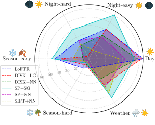
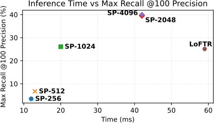
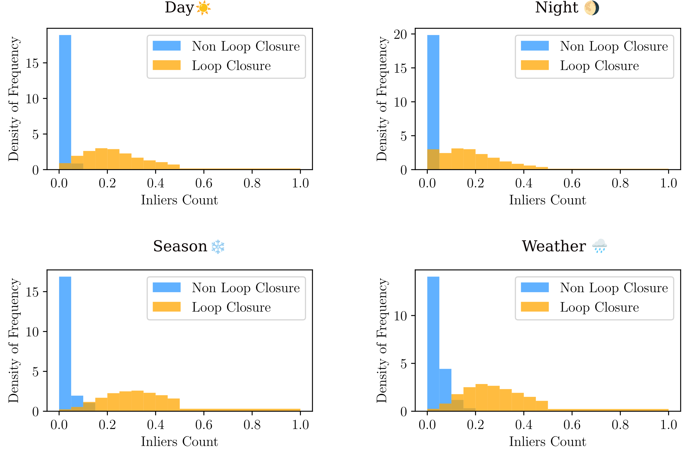

# GV-Bench: Benchmarking Local Feature Matching for Geometric Verification of Long-term Loop Closure Detection

<!--  -->
<p align="center">

</p>

<!-- (Under construction, full codes and results comming soon!) Feel free to dorp me an email or leave an issue!

This repo contains the implementation of GV-Bench, aiming at providing a fair and accessible benchmark for geometric verification. We employ three datasets Oxford Robotcar, Nordland, and UAcampus, containing appearance changes over long period. -->
<!-- ## Visualization of Image Matching -->
## Abstract
Visual loop closure detection is an important module in visual simultaneous localization and mapping (SLAM), which associates current camera observation with previously visited places. Loop closures correct drifts in trajectory estimation to build a globally consistent map. However, a false loop closure can be fatal, so verification is required as an additional step to ensure robustness by rejecting the false positive loops. Geometric verification has been a well-acknowledged solution that leverages spatial clues provided by local feature matching to find true positives. Existing feature matching methods focus on homography and pose estimation in long-term visual localization, lacking references for geometric verification. To fill the gap, this paper proposes a unified benchmark targeting geometric verification of loop closure detection under long-term conditional variations. Furthermore, we evaluate six representative local feature matching methods (handcrafted and learning-based) under the benchmark, with in-depth analysis for limitations and future directions.

### Run-time Analysis
We measure the runtime of six methods listed in Table I on NVIDIA GeForce RTX 3090 GPU and Intel i7-13700K CPU over 10K runs. The results are shown in figure below as inference time over performance, i.e., max recall @100 precision. We can conclude that the runtime of six local feature matching methods is at a millisecond level on a modern GPU. The choice can be made based on the trade-off between time efficiency and performance.
<p align="center">

</p>

## News
- :rocket: Releasing the visualization of [image matching](./assets/appendix.pdf) results. ([google drive](https://drive.google.com/file/d/1145hQb812E0HaPGekdpD04bEbjuej4Lx/view?usp=drive_link))

- :rocket: :rocket: Releasing the benchmark (easy)! Checkout the image pairs from `dataset/release/pairs` and images from [google drive](https://drive.google.com/drive/folders/1E8m353fi3hv-gaytJuRPLhFeNLPWTak6?usp=sharing) 
- :star: Benchmark usage is coming soon!

## Release Timeline
- [x] Appendix for visualization
  - [x] Visualization of image matches
  - [x] Visualization of inliers' distirbution (SP.+SG.)
    <p align="center">
    
    </p>
- [ ] Release benchmark sequences.
  - [x] Benchmark-easy (Day, Night, Weather, Season) 
    <!-- - [x] Day
    - [x] Weather
    - [x] Night-easy
    - [x] Season-easy -->
  - [ ] Benchmark-hard (For sever viewpoint and conditional variations.)
- [x] Release Local feature extraction and matching implementation
- [x] Release evaluation tools
- [x] Release data analysis tools
- [ ] Expansion to other verification methods
  - [x] Dopplergangers
  - [ ] Semantics
  - [ ] Keypoint topology
- [ ] Release sequence version of benchmark (TODO)


## Installation
We use part of the HLoc code for feature extraction and matching.  
```bash
git clone && cd GV-Bench
git submodule init
git submodule update
cd third_party/Hierarchival-Localization
git checkout gvbench # this is a customized fork version
python -m pip install -e .
```

## Usage
- Download the dataset sequences from [google drive](https://drive.google.com/file/d/1145hQb812E0HaPGekdpD04bEbjuej4Lx/view?usp=drive_link) and put it under the `dataset/` folder.
- Extract and match feature using hloc.
  - Extract features: SIFT, SuperPoint, and DISK
    ```bash
    cd third_party/Hierarchical-Localization
    python gvbench_utils.py --extraction --image_path /path/to image/ --output_path /path/to/output
    python gvbench_utils.py --extraction --image_path dataset/images/ --output_path dataset/output/features/
    ```
  - Match features: SIFT-NN, SIFT-LightGlue (Not yet implemented), SuperPoint-NN, DISK-NN, SuperPoint-SuperGlue, SuperPoint-LightGlue, DISK-LightGlue, LoFTR
    ```bash
    # all methods except LoFTR
    cd third_party/Hierarchical-Localization
    python gvbench_utils.py --matching --pairs /path/to/pairs 
                --features /path/to/feature/root/folder 
                --output_path /path/to/matches/output

    # LoFTR is different from above methods thus
    cd third_party/Hierarchical-Localization
    python gvbench_utils.py --matching_loftr --pairs datasets/GV-Bench/release/gt/day.txt 
            --features datasets/GV-Bench/release/features 
            --output_path datasets/GV-Bench/release/matches
    ```
  - We also provide the easy to run scripts
    ```bash
    cd third_party/Hierarchical-Localization
    bash ./gvbench_utils.sh
    ```
  
  - Image pairs files
    - We prepare pairs (GT) file for matching under `dataset/gt` foler.
    - Make sure to use the fork hloc for feature extraction and matching `https://github.com/jarvisyjw/Hierarchical-Localization.git -b gvbench` 

- Evaluation 
  - We provide out-of-box scripts
  ```bash
  cd GV-Bench/scripts
  bash ./evaluation <day> # run script with 
  #sequence name: day, night, season, weather
  ```
  - Exp Results (IROS-Version):
  
    - The log files are automatically generated as `{exp}.log` and `{exp}.npy`

    ```python
    np.save(str(export_dir), {'prob': num_matches_norm,
                                      'qImages': qImages,
                                      'rImages': rImages,
                                      'gt': labels, 
                                      'inliers': inliers_list,
                                      'all_matches': pointMaps,
                                      'precision': precision, 
                                      'recall': recall, 
                                      'TH': TH,
                                      'average_precision': average_precision,
                                      'Max Recall': r_recall})
    ```

    - Exp Results (Easy):
  
    Max Recall @100 Precision (MR%)

    | Method | Day    | Night  | Weather | Season |
    | :----- | :----- | :----- | :-----  | :----- |
    | SIFT+NN| 35.974 | 8.664  |  45.726 | 28.423 |
    | SP.+NN | 53.523 | 15.055 |  55.025 | 47.835 |
    | SP.+SG.| 48.267 | **30.609** |  **66.514** | **74.633** |
    | DISK+NN| 58.029 | 24.484 |  27.842 | 28.629  |
    |DISK+LG.| **60.989** | 25.040 |  36.886 | 72.419 |
    | LoFTR  | 45.336 | 18.206 |  12.096 | 45.598 |

    Average Precision (AP%)

    | Method | Day    | Night  | Weather | Season |
    | :----- | :----- | :----- | :-----  | :----- |
    | SIFT+NN| 98.094 | 62.106 | 99.727  | 98.869 |
    | SP+NN  | 99.315 | 86.819 | 99.804  | 99.707 |
    | SP.+SG.| **99.634** | 95.969 | **99.911**  | **99.907** |
    | DISK+NN| 97.367 | 51.723 | 99.725  | 99.037 |
    |DISK+LG.| 99.656 | 81.447 | 99.875  | 99.864 |
    | LoFTR  | 99.500 | **97.881** | 99.874  | 99.874 |

    - Exp Results (Hard):
  
    Max Recall @100 Precision (MR%)

    | Method | Night  | Season  |
    | :----- | :----- | :----- |
    | SIFT+NN| 20.896 | 3.547  |  
    | SP.+NN | 25.124 | 3.660 |  
    | SP.+SG.| 39.303 | 6.250 |  
    | DISK+NN| 18.905 | 7.151 |  
    |DISK+LG.| 4.726 | 8.164 |  
    | LoFTR  | 25.124 | 13.063 |  

    Average Precision (AP%)

    | Method | Night  | Season | 
    | :----- | :----- | :----- | 
    | SIFT+NN| 53.483 | 13.593 | 
    | SP+NN  | 74.106 | 52.776 | 
    | SP.+SG.| 85.353 | 71.141 | 
    | DISK+NN| 62.744 | 17.844 |
    |DISK+LG.| 78.626 | 63.831 | 
    | LoFTR  | 80.948 | 81.109 | 

    - Exp using pre-trained [doppelgangers](https://github.com/RuojinCai/doppelgangers)
    
    Max Recall @100 Precision (MR%)

    | Method | Day    | Night  | Weather | Season |
    | :----- | :----- | :----- | :-----  | :----- |
    | MR     | 35.465 | 1.991  | 30.011  | 22.435 |
    | AP     | 97.056 | 60.759 | 99.574  | 99.134 |

- Visualization
  - Demos are presented in `plot_data.ipynb`

## Acknowledgement
- This work builds upon [hloc](https://github.com/cvg/Hierarchical-Localization), thanks for their amazing work.
- Contact: `jingwen.yu@connect.ust.hk`

